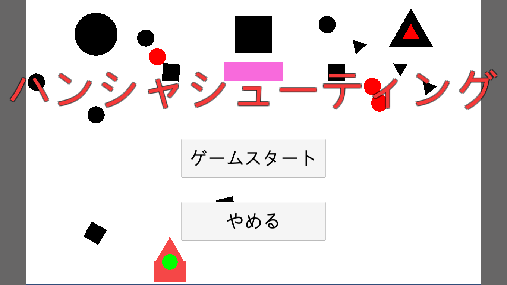
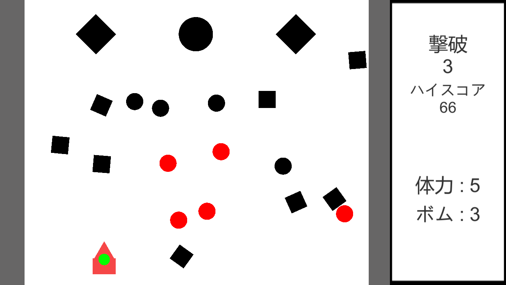
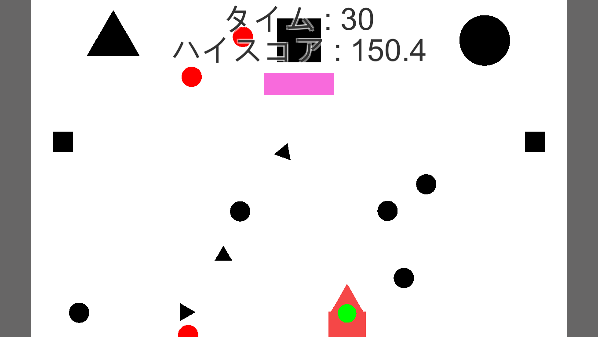

# HansyaShooting

## HansyaShootingの概要

Unityを使用して作成した、弾が反射する2Dのシューティングゲームです。

## 使用したUnityのバージョン

Unity 2019.2.3f1

## 遊び方

- このゲームの弾はプレイヤーや敵、そして他の弾に当たると反射してしまい、縦横無尽に動きます。
- プレイヤーが放った弾に当たっても、プレイヤーはダメージを受けてしまいます。そのため、自分が打った弾にも対処する必要があります。
- プレイヤーはその弾幕を避けるか、被弾しそうな弾に弾を放って跳ね返してください。

## モード
  - スコアアタック
    - 多くの敵を倒して、高得点を狙うモードです。
    - ボムを使用することで、全ての弾を消去することができます。
    - 敵を倒すとアイテムが出現することがあります。
    - 体力が0になるとゲームが終了します。
  - タイムアタック
    - 敵の攻撃をかわし続けて、高得点を狙うモードです。
    - ボムやアイテムは登場しません。
    - 一度でも攻撃に当たるとゲームが終了します。

## 操作方法

このゲームはキーボードとマウスを使います。
- WASDキー,方向キー : 移動
- 左クリック : 弾をマウスカーソルの方向に放つ
- 右クリック : ボムを消費して、画面上の弾を全て消去する(スコアアタックモードのみ)
- スペースキー : ポーズ

## プロジェクトのファイル構成

- HansyaShooting : ゲームのプロジェクトのファイル
  - Assets : Unityプロジェクトで使用するコンテンツのディレクトリ
    - Image : ゲームに使用した画像ファイルのディレクトリ
      - Item : アイテムの画像のディレクトリ
        1. bomu.png : ボムの残数を回復させるアイテムの画像
        2. Life.png : 体力を回復させるアイテムの画像
      - Sonota : アイテム、スプライト以外の画像ファイルのディレクトリ
        1. Cursor.png : マウスカーソルの画像
        2. Hansya_Icon_1024.png : exeファイルのアイコンの画像
        3. WhiteBlock.png : ゲーム中の得点やプレイヤーの情報を表示する部分に表示する画像
      - Sprite : Unityで用意されている図形の画像のディレクトリ
        1. Circle.png : 丸の画像
        2. Square.png : 四角形の画像
        3. Triangle.png : 三角形の画像
    - Object : 使用したオブジェクトのディレクトリ
      - Chara : プレイヤー、敵のオブジェクトのディレクトリ
        - Enemy : 敵のオブジェクトのディレクトリ
          1. Enemy_Circle.prefab : 丸の敵
          2. Enemy_Circle_Elite.prefab : 丸の敵の強化版
          3. Enemy_Triangle.prefab : 三角形の敵
          4. Enemy_Triangle_Elite.prefab : 三角形の敵の強化版
          5. Enemy_Rhombus.prefab : ひし形の敵
          6. Enemy_Rhombus_Elite.prefab : ひし形の敵の強化版
          7. Enemy_Square.prefab : バリアを張っている四角形の敵
          8. Enemy_Square_Elite.prefab : バリアを張っている四角形の敵の強化版
        - Player.prefab : プレイヤーのオブジェクト
      - Item : アイテムのオブジェクトのディレクトリ
        1. Bomu_Item.prefab : ボムを１回復させるアイテム
        2. Kabe_Item.prefab : プレイヤーの正面にバリアを張るアイテム
        3. Life_Item.prefab : 体力を１回復させるアイテム
      - Tama : 弾のオブジェクトのディレクトリ
        - Circle_Bu.prefab : 丸の弾のオブジェクト
        - Triangle_Bu.prefab : 三角形の弾のオブジェクト
        - Square_Bu.prefab : 四角形の弾のオブジェクト
      - UI : 画面上に表示するテキストのオブジェクトのディレクトリ
        1. GameOver.prefab : ゲームが終了した時に表示するテキスト
        2. Pause.prefab : ポーズ中に表示するテキスト
      - Wall : ゲーム中に登場する壁のオブジェクトのディレクトリ
        - Player_Kabe.prefab : プレイヤー、敵に追従するバリア
        - Sikaku_Wall.prefab : 左右にある壁
        - ScoreAttack : スコアアタックで使用する壁のオブジェクトのディレクトリ
          1. Maru_kabe.prefab : 上から下に移動する丸の壁
          2. Sankaku_kabe.prefab : 上から下に移動する三角の壁
          3. Sikaku_kabe.prefab : 上から下に移動する四角の壁
        - TimeAttack : タイムアタックで使用する壁のオブジェクトのディレクトリ
          1. Maru_kabe.prefab : 上から下に移動する丸の壁
          2. Sankaku_kabe.prefab : 上から下に移動する三角の壁
          3. Sikaku_kabe.prefab : 上から下に移動する四角の壁
    - Scene : ゲームのシーンのディレクトリ
      1. Title : タイトル画面のシーン
      2. ScoreAttack : スコアアタックモードのシーン
      3. TimeAttack : タイムアタックモードのシーン
    - Script : ゲームで使用するプログラムのディレクトリ
      - Game : ゲームを遊ぶシーンで使用するプログラムのディレクトリ
        1. Audio.cs : 効果音のファイルをまとめ、必要な効果音を鳴らすプログラム
        2. Cursor_Manager.cs : マウスカーソルとプレイヤーの弾の発射を管理
        3. Enemy.cs : 敵の行動のプログラム
        4. Enemy_Dasu.cs : 敵を生成するプログラム
        5. Item.cs : アイテムのプログラム
        6. Make_Wall.cs : 上から下に動く動く壁を定期的に生成するプログラム
        7. Matome.cs : プレイヤーの残りの体力とボムの管理、テキストの処理,ゲームオーバーの処理,ポーズの処理,アイテムのドロップの処理を行うプログラム
        8. Move_Wall.cs : 上から下に動く壁を移動させるプログラム
        9. Player.cs : プレイヤーの操作のプログラム
        10. Tama.cs : 弾の移動を行うプログラム
        11. Wall_Life.cs : バリアの体力を管理するプログラム
      - Title.cs : タイトル画面で使用するプログラム
    - Sound : ゲーム中に使用するBGM、効果音のディレクトリ
      1. BGM_Title.mp3 : タイトル画面のBGM
      2. Game_BGM.mp3 : プレイ画面のBGM
      3. Enemy_Gekiha.mp3 : 敵を撃破した時の効果音
      4. Baria_Break.mp3 : バリアが破壊されたときの効果音
      5. Gameover.mp3 : ゲームが終了した時の効果音
      6. Hansya.mp3 : 弾が反射した時の効果音
      7. Hit_Player.mp3 : プレイヤーに球が命中した時の効果音
      8. Item.mp3 : アイテムを取得した時の効果音
      9. Pause.mp3 : ポーズを行った時、解除したときの効果音
      10. shot.mp3 : 弾を打ったときの効果音
      11. Use_Bomu.mp3 : ボムを使用した時の効果音
  - Packages : パッケージのディレクトリ
  - ProjectSettings : プロジェクトの各種設定を保存するディレクトリ
  - Readme_Screenshot : READMEファイルに使用したゲームのスクリーンショットのディレクトリ
    1. HansyaShooting_SS_Play.png : プレイ画面のスクリーンショット
    2. HansyaShooting_SS_Title.png : タイトル画面のスクリーンショット
  - .gitattributes
  - .gitignore
  - README.md : プロジェクトの概要を記述したファイル

## タイトル画面のスクリーンショット

## スコアアタックのスクリーンショット

## タイムアタックのスクリーンショット

