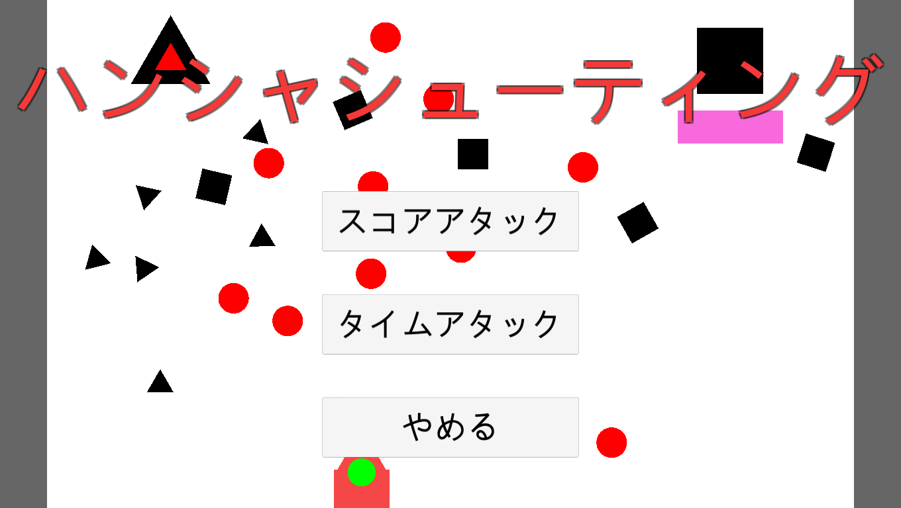

# HansyaShooting

## HansyaShootingの概要

Unityを使用して作成した、弾が反射する2Dのシューティングゲームです。

## ゲームの遊び方

- このゲームの弾はプレイヤーや敵、そして他の弾に当たると反射してしまい、縦横無尽に動きます。
- プレイヤーが放った弾に当たっても、プレイヤーはダメージを受けてしまいます。それは敵も同じです。そのため、自分が打った弾は避けなくてはならない弾幕の 一部に変化します。
- プレイヤーはその弾幕を避けるか、被弾しそうな弾に弾を放って跳ね返してください。
- 多くの敵を倒して高得点を目指すことがこのゲームの目的です。

## 操作方法

このゲームはキーボードとマウスを使います。コントローラー等の操作は対応していません。
- WASDキー,方向キー : 移動
- 左クリック : 弾をマウスカーソルの方向に放つ
- 右クリック : 画面上の弾を全て消去する(ボムの残数が0の場合は使用できません)
- スペースキー : ポーズ

## プロジェクトのファイル構成

HansyaShooting_Project : ゲームのプロジェクトのファイル
  (ア) .vs
  (イ) Assets : Unityプロジェクトで使用するコンテンツのディレクトリ
    ① Image : ゲームに使用した画像ファイルのディレクトリ
      1. Item : アイテムの画像のディレクトリ
        (ア) bomu.png : ボムの残数を回復させるアイテムの画像
        (イ) Life.png : 体力を回復させるアイテムの画像
      2. Sonota : アイテム、スプライト以外の画像ファイルのディレクトリ
        (ア) Cursor.png : マウスカーソルの画像
        (イ) Hansya_Icon_1024.png : exeファイルのアイコンの画像
        (ウ) WhiteBlock.png : ゲーム中の得点やプレイヤーの情報を表示する部分に表示する画像
      3. Sprite : Unityで用意されている図形の画像のディレクトリ
        (ア) Circle.png : 丸の画像
        (イ) Square.png : 四角形の画像
        (ウ) Triangle.png : 三角形の画像
    ② Object : 使用したオブジェクトのディレクトリ
      1. Chara : プレイヤー、敵のオブジェクトのディレクトリ
        (ア) Title_You : タイトル画面用にサイズを調整した敵のオブジェクトのディレクトリ
          ① Enemy_Circle 1.prefab : 丸の敵
          ② Enemy_Circle_Elite 1.prefab : 丸の敵の強化版
          ③ Enemy_Sankaku 1.prefab : 三角形の敵
          ④ Enemy_Sankaku_Elite 1.prefab : 三角形の敵の強化版
          ⑤ Enemy_sikaku.prefab : 四角形の敵
          ⑥ Enemy_sikaku_Elite.prefab : 四角形の敵の強化版
          ⑦ Enemy_sikaku_Wall 1.prefab : バリアを張っている四角形の敵
          ⑧ sikaku_Wall_Elite 1.prefab : バリアを張っている四角形の敵の強化版
        (イ) Enemy : 敵のオブジェクトのディレクトリ
          ① Enemy_Circle.prefab : 丸の敵
          ② Enemy_Circle_Elite.prefab : 丸の敵の強化版
          ③ Enemy_Sankaku.prefab : 三角形の敵
          ④ Enemy_Sankaku_Elite.prefab : 三角形の敵の強化版
          ⑤ Enemy_sikaku.prefab : 四角形の敵
          ⑥ Enemy_sikaku_Elite.prefab : 四角形の敵の強化版
          ⑦ Enemy_sikaku_Wall.prefab : バリアを張っている四角形の敵
          ⑧ sikaku_Wall_Elite.prefab : バリアを張っている四角形の敵の強化版
        (ウ) Player.prefab : プレイヤーのオブジェクト
      2. Item : アイテムのオブジェクトのディレクトリ
        (ア) Bomu_Item.prefab : ボムを１回復させるアイテムKabe_Item.prefab : プレイヤーの正面にバリアを張るアイテム
        (イ) Life_Item.prefab : 体力を１回復させるアイテム
      3. Tama : 弾のオブジェクトのディレクトリ
        (ア) Title_You : タイトル画面用にサイズを調整した弾のディレクトリ
          ① Kuro_Circle.prefab : 丸の弾のオブジェクト
          ② Sankaku_kuro.prefab : 三角形の弾のオブジェクト
          ③ Sikaku_kuro.prefab : 四角形の弾のオブジェクト
        (イ) Kuro_Circle 1.prefab : 丸の弾のオブジェクト
        (ウ) Sankaku_kuro 1.prefab : 三角形の弾のオブジェクト
        (エ) Sikaku_kuro 1.prefab : 四角形の弾のオブジェクト
      4. UI : 画面上に表示するテキストのオブジェクトのディレクトリ
        (ア) GameOver.prefab : ゲームが終了した時に表示するテキスト
        (イ) Pause.prefab : ポーズ中に表示するテキスト
      5. Wall : ゲーム中に登場する壁のオブジェクトのディレクトリ
        (ア) Player_Kabe.prefab : プレイヤー、敵に追従するバリア
        (イ) Maru_kabe.prefab : 上から下に移動する丸の壁
        (ウ) Sankaku_kabe.prefab : 上から下に移動する三角の壁
        (エ) Sikaku_kabe.prefab : 上から下に移動する四角の壁
        (オ) Sikaku_Wall.prefab : 左右にある壁
    ③ Scene : ゲームのシーンのディレクトリ
      1. Title : タイトル画面のシーン
      2. Game : ゲームを遊ぶ画面のシーン
    ④ Script : ゲームで使用するプログラムのディレクトリ
      1. Game : ゲームを遊ぶシーンで使用するプログラムのディレクトリ
        (ア) Audio.cs : 効果音のファイルをまとめ、必要な効果音を鳴らすプログラム
        (イ) Cursor_Manager.cs : マウスカーソルとプレイヤーの弾の発射を管理
        (ウ) Enemy.cs : 敵の行動のプログラム
        (エ) Enemy_Dasu.cs : 敵を生成するプログラム
        (オ) Item.cs : アイテムのプログラム
        (カ) Make_Wall.cs : 上から下に動く動く壁を定期的に生成するプログラム
        (キ) Matome.cs : プレイヤーの残りの体力とボムの管理、テキストの処理,ゲームオーバーの処理,ポーズの処理,アイテムのドロップの処理を行うプログラム
        (ク) Move_Wall.cs : 上から下に動く壁を移動させるプログラム
        (ケ) Player.cs : プレイヤーの操作のプログラム
        (コ) Tama.cs : 弾の移動を行うプログラム
        (サ) Wall_Life.cs : バリアの体力を管理するプログラム
      2. Title.cs : タイトル画面で使用するプログラム
    ⑤ Sound : ゲーム中に使用するBGM、効果音のディレクトリ
      1. BGM_Title.mp3 : タイトル画面のBGM
      2. Game_BGM.mp3 : 遊ぶ画面のBGM
      3. Enemy_Gekiha.mp3 : 敵を撃破した時の効果音
      4. Baria_Break.mp3 : バリアが破壊されたときの効果音
      5. Gameover.mp3 : ゲームが終了した時の効果音
      6. Hansya.mp3 : 弾が反射した時の効果音
      7. Hit_Player.mp3 : プレイヤーに球が命中した時の効果音
      8. Item.mp3 : アイテムを取得した時の効果音
      9. Pause.mp3 : ポーズを行った時、解除したときの効果音
      10. shot.mp3 : 弾を打ったときの効果音
      11. Use_Bomu.mp3 : ボムを使用した時の効果音
  (ウ) Library : Unityが自動的に管理する、データの読み込みを早くする役割のディレクトリ
  (エ) Logs : ログファイルのディレクトリ
  (オ) Obj : 生成される一時ファイルを格納するディレクトリ
  (カ) Packages : パッケージのディレクトリ
  (キ) ProjectSettings : プロジェクトの各種設定を保存するディレクトリ

## タイトル画面のスクリーンショット

## ゲーム画面のスクリーンショット

